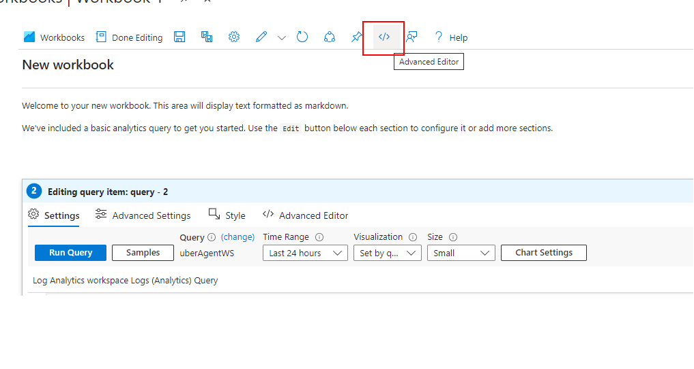

## Connecting uberAgent Metrics to Azure Workbook

This document will walk you through the steps to visualize uberAgent metrics collected in Azure Monitor through Azure Workbooks. Example Azure Workbook definitions are provided to easily get started with the metric visualizations.

### Table of contents
  - [Creating Azure Log Analytics workspace](#creating-azure-log-analytics-workspace)
  - [Integrating uberAgent with Log Analytics workspace](#integrating-uberagent-with-log-analytics-workspace)
  - [Import Azure Workbook templates to your Azure Log Analytics Workspace](#import-azure-workbook-templates-to-your-azure-log-analytics-workspace)
      - [Option 1: Use powershell](#option-1--use-powershell)
      - [Option 2: Use the workbook files in the repo and manually add them to your workspace](#option-2--use-the-workbook-files-in-the-repo-and-manually-add-them-to-your-workspace)
        - [Importing workspace files](#importing-workspace-files)
        - [Linking the workspaces](#linking-the-workspaces)

### Creating Azure Log Analytics workspace

[Creating Azure Log Analytics workspace](../README.md#creating-azure-log-analytics-workspace)

### Integrating uberAgent with Log Analytics workspace

[Integrating uberAgent with Log Analytics workspace](../README.md#integrating-uberagent-with-log-analytics-workspace)
   

### Import Azure workbook templates to your Azure Log Analytics Workspace

You can either use the [powershell script](https://github.com/citrix/uberagent-integrations/blob/main/azure-monitor/azure-workbooks/ImportWorkbooks.ps1) in the repo or manually add the individual workbooks to import the workbooks.

##### Option 1 : Use powershell

* Note down the "Resource Group", "Workspace Name" and "Subscription ID" of the workbook to which uberAgent is integrated
* Make sure your account has the necessary permissions to create a new workspace in CLI
 
* Download the [powershell script](https://github.com/citrix/uberagent-integrations/blob/main/azure-monitor/azure-workbooks/deploy-workbooks.ps1) from the repo
* Open "Powershell"
* Navigate to the folder to which you have downloaded the ps1 file
* Make sure you have the [Azure CLI](https://learn.microsoft.com/en-us/cli/azure/) installed in your machine
* Login to your account by running `az login`
* Navigate to the AzureWorkbook folder
* run the powershell script by running `.\deploy-workbooks.ps1`
* It will ask for "Subscription Id", "Resource Group Name" and "Workspace Name"
* You can copy the values from Azure Portal and paste them in the CLI (ctrl+v or mouse right click)
* You can also run the script passing all the parameters in a single step by running `.\deploy-workbooks.ps1 -subscriptionId <Your Subscription ID> -WorkspaceName <Your Workspace Name> -resourceGroup <Your Resource Group>`
* The script will import the templates to your Azure Workbooks

##### Option 2 : Use the workbook files in the repo and manually add them to your workspace

###### Importing workspace files

* Navigate to [Workbooks](https://github.com/citrix/uberagent-integrations/tree/main/azure-monitor/azure-workbooks/workbooks) folder in the repo
* Open the first workbook file and copy the contents
* Open Azure portal and navigate to your Log Analytics Workspace.
* Click on "+New" icon

* In the "New" screen, click on advanced editor

* Paste the contents you copied from workspace file in "Gallery Template" tab
* Click "Apply", "Done editing" and then the "Save" button
* A prompt for populating some parameters will pop-up:
   - Title: Set a unique workbook title
   - Subscription
   - Resource Group
   - Location
* Finally click "Apply" to save the parameter values and "Save" to store the workbook.
* Repeat the same for all files

The newly created workbook can be found under the Log Analytics Workspace > Workbooks list. It can also be found in the parent Resource Group.

###### Linking the workspaces
The `citrix_session_configuration_details` and `citrix_machine` can be linked to `citrix_session_single_user_details` and `citrix_single_machine_details` workbooks respectively to have a seamless drill-down view. Follow these steps

* in the "Workbooks" home page, in the tile corresponding to "citrix_single_machine_details", click on the 3 dots and select "View Resource"
* Copy the resource id

* Go back to "Workbooks" home page and click on the tile corresponding to the "citrix_session_configuration_details" and open the workbook
* Click on "Edit" and go to "advanced editor"

* In the Gallery template tab, search for "templateId".
* Replace the TemplateId with the resource id of "citrix_single_machine_details" - The one you copied in the previous step
* Click "Apply", and Save the workbook by pressing "Save" icon
* Repeat the same for citrix_single_machine_details by copying the resource id and pasting that resource id in the gallery template of citrix_machine workbook
