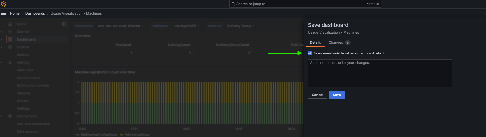
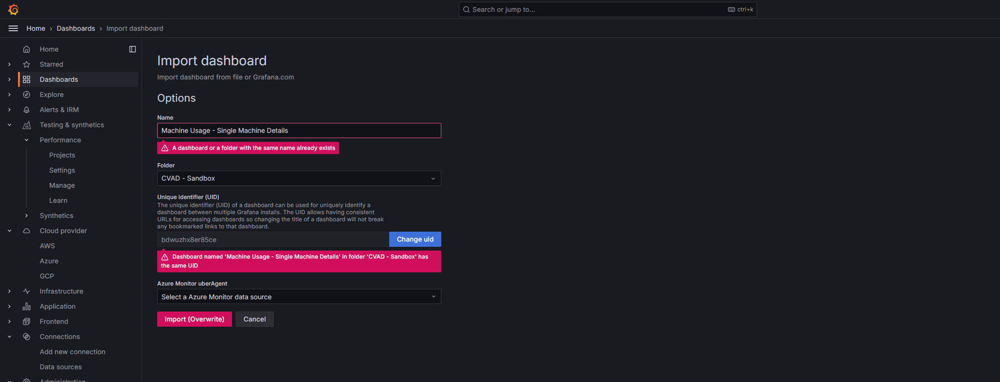

## How to import Grafana dashboards

### Table of contents
  - [Creating Azure Log Analytics workspace](#creating-azure-log-analytics-workspace)
  - [Integrating uberAgent with Log Analytics workspace](#integrating-uberagent-with-log-analytics-workspace)
  - [Configuring Grafana with Log Analytics workspace](#configuring-grafana-with-log-analytics-workspace)
    - [Create and set up App Registration in Azure](#create-and-set-up-app-registration-in-azure)
    - [Configure a Log Analytics data source in Grafana](#configure-a-log-analytics-data-source-in-grafana)
    - [Import a dashboard](#import-a-dashboard)
    - [Dashboard preview](#dashboard-preview)
    - [Updating a dashboard](#updating-a-dashboard)

### Creating Azure Log Analytics workspace

[Creating Azure Log Analytics workspace](../README.md#creating-azure-log-analytics-workspace)

### Integrating uberAgent with Log Analytics workspace

[Integrating uberAgent with Log Analytics workspace](../README.md#integrating-uberagent-with-log-analytics-workspace)

### Configuring Grafana with Log Analytics workspace

#### Create and set up App Registration in Azure
  - Go to App Registrations in Azure and create a new Registration.
  - Get Application (client) ID from the Overview Page.
  - In Manage → Certificates & secrets → Client secrets, Add a new client secret. Save the Value (Client secret)
    
    
  - In Log Analytics workspace → Access Control → Role assignments, search for the App registration and give **Contributor** role to it.
    

#### Configure a Log Analytics data source in Grafana

- Select "Connections" > "Data sources" > "Add new data source"
- Find and select the "Azure Monitor" data source type
    
- Fill the data source name and authentication information saved during App registration.
- Click "Save & test"

#### Import a dashboard

- Navigate to "Dashboards"
- Click on the "New" button and then select "Import"
- Browse for and select the dashboard definition (.json file) to import
- Select the Azure Monitor data source configured above
    
- Click "Import"
- The newly imported dashboard will then open.
- In the selectors at the top, select the Subscription and the Log Analytics workspace. The data queries should then succeed and you should see the charts populated with data. If needed, you can adjust the selected time window.
- After the Subscription and Workspace is selected, the dashboard can be saved by checking the below box to persist the selected values.
  

#### Dashboard preview

#### Updating a dashboard
- While updating an existing dashboard, Import (Overwrite) the new JSON file, and keep the original UID
  