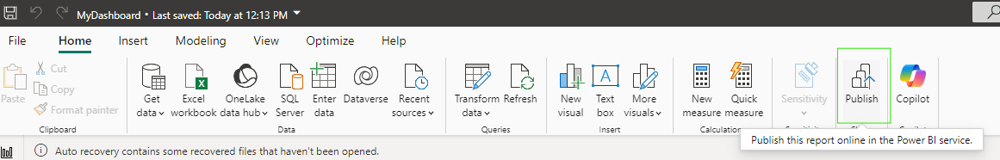
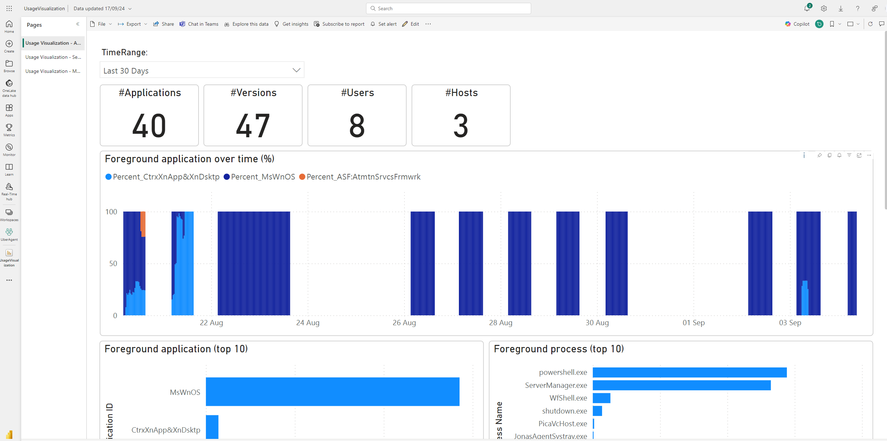

## How to use the PowerBI template

For PowerBI, a template file (.pbit) is provided.
The file includes a set of pre-built reports based on the collected uberAgent metrics.
The reports reference datasets which are generated from Kusto queries to the Log Analytics workspace which is configured to collect uberAgent metrics.

### Table of contents
  - [Creating Azure Log Analytics workspace](#creating-azure-log-analytics-workspace)
  - [Integrating uberAgent with Log Analytics workspace](#integrating-uberagent-with-log-analytics-workspace)
  - [Loading the template](#loading-the-template)
    - [Troubleshooting](#troubleshooting)
  - [Publishing the template](#publishing-the-template)
  - [Dashboard preview](#dashboard-preview)
  - [Configured scheduled refresh](#configured-scheduled-refresh)

### Creating Azure Log Analytics workspace

[Creating Azure Log Analytics workspace](../README.md#creating-azure-log-analytics-workspace)

### Integrating uberAgent with Log Analytics workspace

[Integrating uberAgent with Log Analytics workspace](../README.md#integrating-uberagent-with-log-analytics-workspace)

### Loading the template

- Open PowerBI desktop.  
  Note that the template was created with PowerBI version 2.132.1053.0 64-bit (August, 2024). You may need to upgrade to successfully open the template file.
- Navigate to "File" > "Import" > "Power BI Template" and select the .pbit file downloaded from the Github repository.
- Upon the importing, you will be prompted to provide the Log Analytics connection string, captured as a parameter named "LAConnection".
   
- The value should look like `https://api.loganalytics.io/v1/workspaces/workspace-id/query`.
  
- When prompted, authenticate as needed to access the Web Content and click "Connect".
- A series of datasets will be refreshed, which may take some time, depending on the size of the uberAgent datasets.

#### Troubleshooting
- In case the dataset refresh fails with error: "_Query references other queries or steps, so it may not directly access a data source. Please rebuild this data combination._", please try the following:
    - Navigate to "File" > "Options and settings" > "Options" > "Current File" > "Privacy" > select "Ignore the Privacy Levels" > Click "OK".
    - At the top Home menu, click on "Refresh" to refresh the datasets.

### Publishing the template

You can review the report set included in the template and optionally make enhancements. Once done, you can publish the reports to your PowerBI workspace:
- Click the "Publish" button which is part of the "Home" menu.
    
- Save the project as a .pbix file.
- Select the workspace to publish to.

Reference: https://learn.microsoft.com/en-us/power-bi/create-reports/desktop-upload-desktop-files

### Dashboard preview

### Configured scheduled refresh

In the PowerBI workspace, you can configure a scheduled refresh of the semantic model, e.g. once per day.
- In the workspace, select the uberAgent semantic model.
- On the top menu, select "Refresh" > "Schedule refresh".
- A series of options appear. Click on the "Refresh".
- Enable the refresh schedule toggle.
- Configure the schedule and click "Apply"

Reference: https://learn.microsoft.com/en-us/power-bi/connect-data/refresh-scheduled-refresh