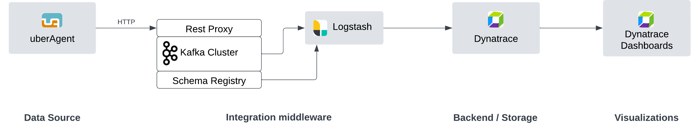

## Integrating uberAgent with Dynatrace and importing dashboards

### Table of contents
- [uberAgent integration with Dynatrace](#uberagent-integration-with-dynatrace)
- [Configuring Logstash to read from Kafka](#configuring-logstash-to-read-from-kafka)
- [Configuring Logstash to forward records to Dynatrace](#configuring-logstash-to-forward-records-to-dynatrace)
- [References](#references)


### uberAgent integration with Dynatrace

uberAgent does not currently directly integrate with platforms like Dynatrace. Thus, an indirect integration path needs to be followed. This involves the use of a Kafka instance and a Logstash instance.



- **Kafka** is already supported as an uberAgent output sink. It can be deployed locally or on the cloud, on a dedicated VM or AKS cluster, on a set of VMs or even in the form of docker containers. The deployment style depends on the customer infrastructure and the CVAD setup size which determines the uberAgent metric volume.
- **Logstash** can be used as a data forwarding vehicle between Kafka and Dynatrace. It can also be installed locally or on the cloud, on a VM or as a docker container, depending on the record volume it is expected to process and forward.   
Logstash was chosen as it supports Kafka as an input plugin and Dynatrace as an output plugin. It also supports message deserialization, as uberAgent uses Avro as message format.

The current documentation will not cover in detail the installation of Kafka and Logstash, as these depend on the installation mode and can be found in their official documentation.

### Configuring Logstash to read from Kafka
The Logstash configuration for reading data from Kafka using the respective input plugin can look like below:

```
input {
  kafka {
    bootstrap_servers => "broker:29092"
    topics => [
              "uberAgent_System_SystemPerformanceSummary2",
              "uberAgent_Process_NetworkTargetPerformance",
              "uberAgent_Config_ConfigInfo",
              "uberAgentESA_Process_DnsQuery",
              "uberAgentESA_System_ScheduledTasks",
              "uberAgent_Application_UIDelay",
              "uberAgent_System_GpuUsageEngine",
              "uberAgent_Process_ProcessDetail",
              "uberAgentESA_System_ScheduledTaskTriggers",
              "uberAgentESA_System_ScheduledTaskActions",
              "uberAgent_Session_SessionDetail",
              "uberAgent_System_GpuUsage"
            ]
    group_id => "logstash_group"
    auto_offset_reset => "earliest"
    schema_registry_url => "http://schema-registry:8081"
  }
}
```
In the above configuration, please replace the 
 - `bootstrap_servers` value with the correct list of bootstrap servers and their port.
 - `group_id` value with the Kafka consumer group ID of preference
 - `schema_registry_url` value with the correct schema registry URI and port

### Configuring Logstash to forward records to Dynatrace
The Logstash configuration for forwarding data to Dynatrace  using the respective output plugin can look like below:

```
output {
  dynatrace {
    id => "dynatrace_output"
    ingest_endpoint_url => "https://oms12345.live.dynatrace.com/api/v2/logs/ingest"
    api_key => "<DYNATRACE-API-KEY>"
  }
}
```
In the above configuration, please replace the 
 - `ingest_endpoint-url` value with the correct Dynatrace instance URI
 - `api_key` value with a valid API key got from Dynatrace settings


### Importing Dynatrace dashboards
As part of the integration of uberAgent with Dynatrace, logs are configured to get ingested in Dynatrace.
Dynatrace automatically detects the log fields, allowing for dashboards to be built on top of them.

A list of pre-built dashboards is provided [here](dashboards).
The dashboards can be imported into a Dynatrace instances following these steps:
* In the Dynatrace UI, navigate to "Dashboards" > "Upload".
* Browse for and select the dashboard .json file.
* New dashboard will show up, populated with values.


### References

 - Kafka
	 - [Kafka documentation](https://kafka.apache.org/documentation/)
	 - [Configuring uberAgent with Kafka](https://docs.citrix.com/en-us/uberagent/current-release/installation/backend/configuring-apache-kafka-confluent-rest-proxy)
	 - [Confluent REST Proxy](https://docs.confluent.io/platform/current/kafka-rest/index.html)
	 - [Confluent Schema Registry](https://docs.confluent.io/platform/current/schema-registry/index.html)
 - Logstash
	 - [Logstash introduction](https://www.elastic.co/guide/en/logstash/current/introduction.html)
	 - [Kafka input plugin](https://www.elastic.co/guide/en/logstash/current/plugins-inputs-kafka.html)
	 - [Datadog output plugin](https://www.elastic.co/guide/en/logstash/current/plugins-outputs-datadog.html)
- Dynatrace
  - [Dynatrace documentation](https://docs.dynatrace.com/docs)  
  - [Observe and explore logs](https://docs.dynatrace.com/docs/observe-and-explore/logs)  
  - [Get started with dashboards](https://docs.dynatrace.com/docs/observe-and-explore/dashboards-and-notebooks/dashboards-new)
