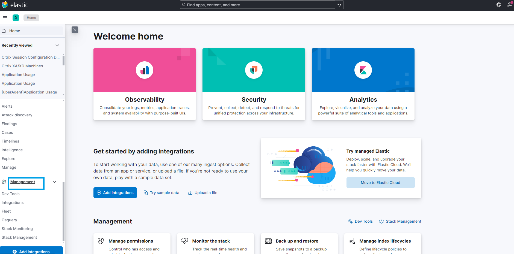
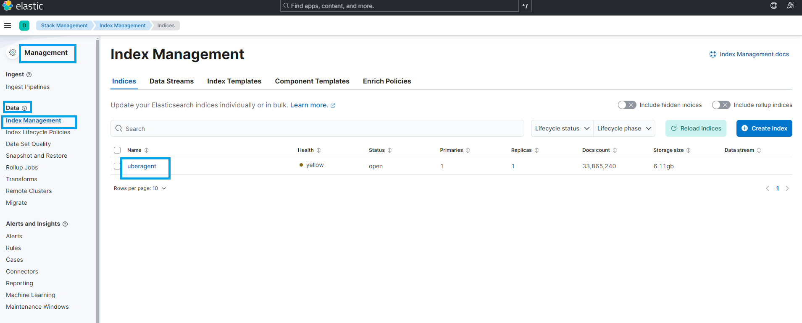
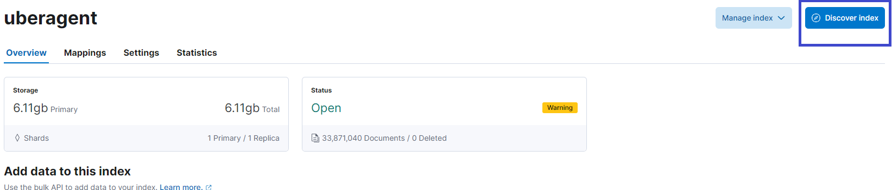
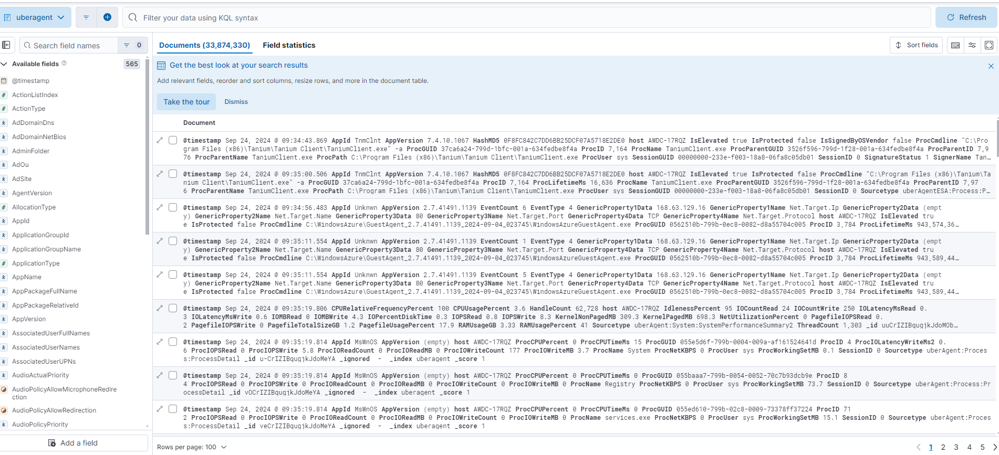

## Integration with Elasticsearch

The steps for configuring Elasticsearch as an uberAgent backend are captured in the [documentation](https://docs.citrix.com/en-us/uberagent/current-release/installation/backend/installing-elasticsearch).

After following the above steps, uberAgent will start sending collected metrics to Elasticsearch. Also, an index named "uberagent" will appear under Kibana.

To check the index "uberagent"

Step1. Click the "**Managemant**" in side bar.

Step2. Click the "**Index Management**" under "**Data**". The index "**uberagent**" will appear.

Step3. Click the "**uberagent**", then click the "**Discover Index**".

Step4. Metrics and logs stored in Elasticsearch can be visualized through Kibana dashboards. Pre-built dashboards are provided to visualize key uberAgent metrics.

