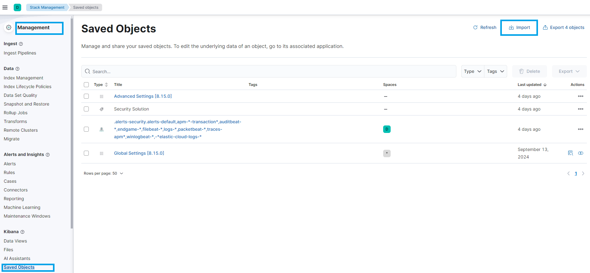
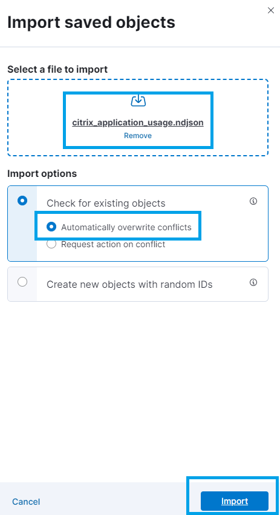
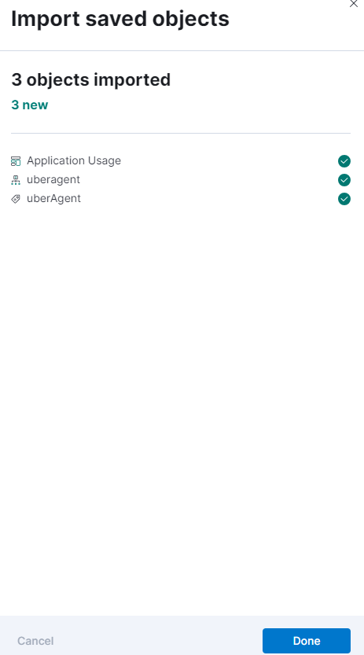
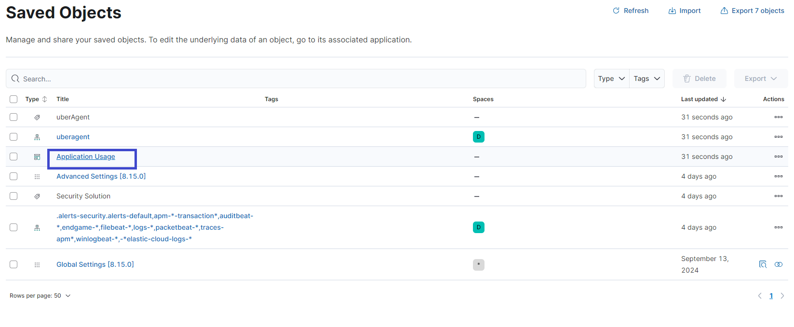
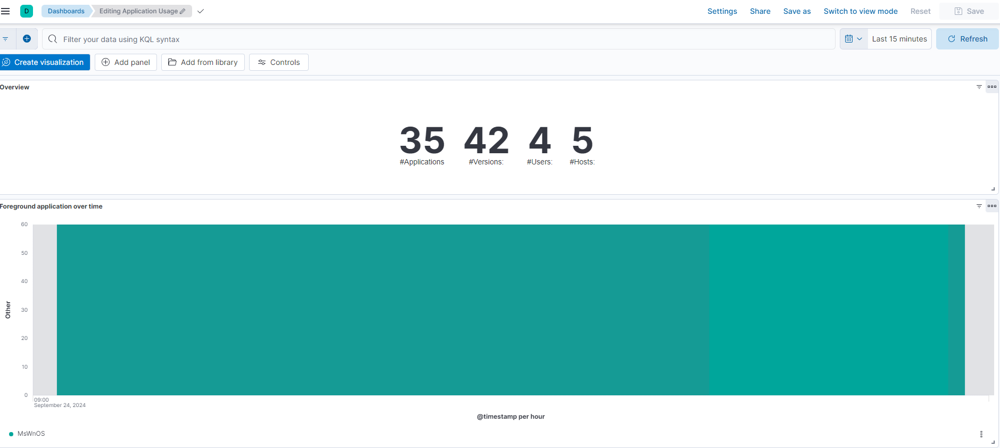

## How to import Kibana dashboards

After following the [documented guidelines](https://docs.citrix.com/en-us/uberagent/current-release/installation/backend/installing-elasticsearch) for configuring uberAgent to forward metrics to Elasticsearch, an index named "uberagent" will be created in Elasticsearch with the required field definitions.

The Kibana dashboards depend on the existence of the above index.
The _ndjson_ files provided include the dashboard definitions, as well as the data view referenced by the dashboards.

The steps to import the dashboards and data view are as follows:

Step1. Open the Kibana UI page. In the main menu, navigate to "**Management**".

Step2. Select "**Kibana**" > "**Saved Objects**". On the top-right, click on "**Import**".

Step3. Select the dashboard of interest (ndjson file)
- Select "_Create new objects with random IDs_" to avoid any conflicts.
- Select "_Automatically overwrite confilicts_" only if this is the first time you import the dashboard for uberAgent, and import all the dashboard from [dashboard](../kibana/dashboards/). These dashboard share some objects.
- Click "**Import**".

Step4. You can now see the imported dashboard in the list and open it.

Step5. Click the dashboard name, then you can check the dashboard now.

